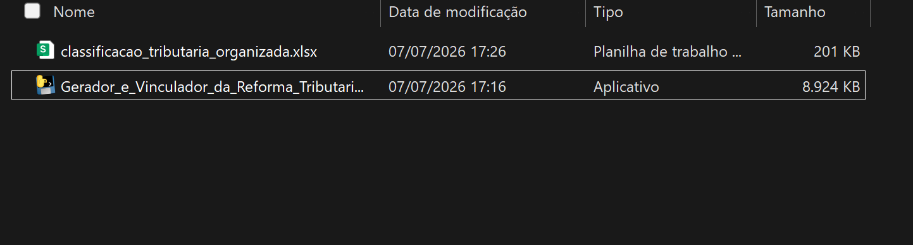
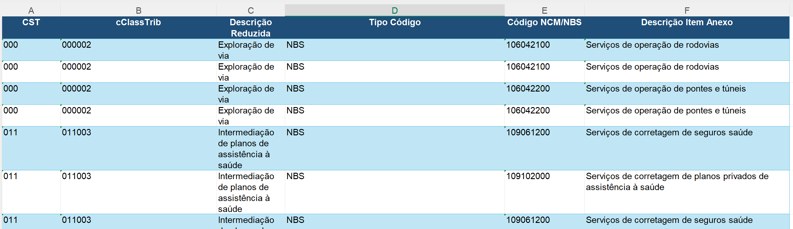
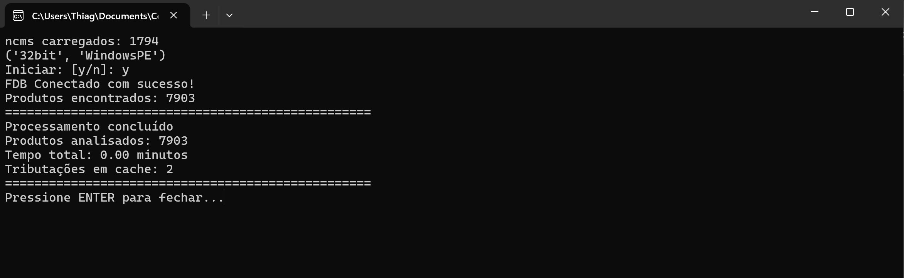
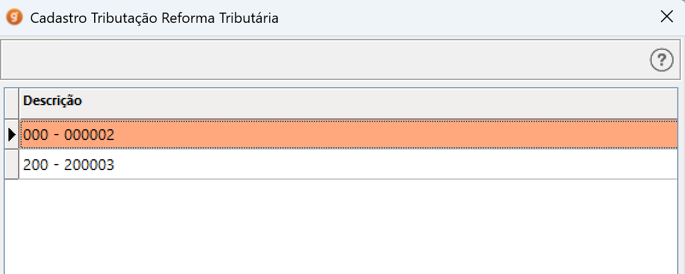
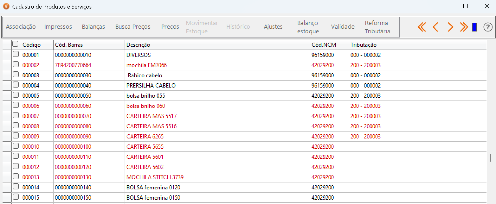

## Objetivo

O objetivo do projeto é automatizar o processo de cadastro de perfis de tributação da Reforma Tributária e vinculação aos itens do estoque com base em seu NCM.

Atualmente, o sistema funciona com conexão com o banco de dados *Firebird* da empresa **GDOOR Sistemas LTDA**, de forma não oficial.

É direcionado para as revendas interessadas em facilitar o processo de preenchimento dos dados da Reforma quando a lei entrar em vigor.

## Estrutura

O projeto é separado em 4 arquivos principais:

````python
conexao_fdb.py
integracao.py
main.py
planilha.py
````
*Para Firebird 5, foi utilizado um interpretador de 32 bits, versão do Python 3.11.9. Interpretadores de 64 bits dificultam o reconheciento da Dll fbclient.dll*

#### conexao_fdb.py

Este arquivo realiza a conexão com o banco de dados para que seja possível realizar queries SQL.

O arquivos inicia as informações de conexão com o banco:
*caminho*: é o caminho onde está o banco de dados;
*usuario*: credencial de acesso ao banco de dados;
*senha*: credencial de acesso ao banco de dados.

Possui duas funções: *conectar_fb5()* e *iniciarPrograma()*.

***conectar_fb5()***: recebe os parâmetros caminho, usuario e senha.
Ela realiza a conexão do banco passando as credenciais para os parâmetros de conexão do *Firebird* e retorna *connect(database,user,password)*.

***iniciarPrograma()***: recebe o parametro *opcao*.
Se a opção for **y**, chama a função *conectar_fb5()*, se receber **n**, finaliza o programa.

````python
from firebird.driver import connect

caminho = r"C:\GDOOR Sistemas\GDOOR PRO\DATAGES.FDB"
usuario = "---"
senha = "---"
  
def conectar_fb5(caminho, usuario, senha):
    return connect(
        database=caminho,
        user=usuario,
        password=senha
    )

def iniciarPrograma(opcao):
    if opcao == "y":

        try:
            conectar_fb5(
                caminho,
                usuario,
                senha
            )
            print("FDB Conectado com sucesso!")
            return 1

        except Exception as e:
            import traceback
            traceback.print_exc(e)        

    elif opcao=="n":
        print("Finalizando programa...")
        return 0
````

#### integracao.py

Este arquivo faz o vínculo entre a planilha *classificacao_tributaria_organizada* e o banco de dados através de queries SQL.

Ele realiza um select geral do estoque e percorre os itens através de um loop for, e preenche os dados do perfil de tributação caso o ncm indicado na planilha seja o mesmo que no item. Após, faz a vinculação desse perfil criado no cadastro do item.

Ao final apresenta o tempo de execução e quantos perfis foram criados.

Tudo é feito dentro da função *sql()*, que será chamada na **main.py**

#### main.py

Inicia um loop while onde enquanto a variável **opcao** for diferente de y ou n, apresentará "Opção invalida" e solicitará a **opcao** novamente.
declara **ret**, chama a função *iniciarPrograma()* passando **opcao** como parâmetro.
Se **ret** for igual a 1, chama a função *sql()*
Ao finalizar, o sistema solicita que você pressione ENTER para fechar a janela.

````python
import conexao_fdb as fdb
import integracao
import platform

print(platform.architecture())
opcao = input("Iniciar: [y/n]: ")
while opcao != "y" and opcao != "n":
    print("opcao invalida")
    opcao = input("Iniciar [y/n]: ")
ret = fdb.iniciarPrograma(opcao)
  
if ret == 1:
    integracao.sql()
input("Pressione ENTER para fechar...")
````

#### planilha.py

Declara **planilha** que recebe o nome da planilha *classificacao_tributaria_organizada.xlsx* e o dicionário **dados_planilha** vazio.
Através de um loop *for*, a planilha é percorrida e os dados tributários dentro dela são salvos em **dados_planilha**, com base na posição da coluna.

````python
from openpyxl import load_workbook

planilha = "classificacao_tributaria_organizada.xlsx"

# ler a planilha
wb = load_workbook(planilha)    

# nome da aba
aba_cst = wb["Anexos"]

# start do dicionario
dados_planilha = {}

for linha in aba_cst.iter_rows(min_row=2, values_only=True):
    ncm = str(linha[3]).strip()

    if not ncm or ncm == "None" or len(ncm) == 9:
        continue

    dados_planilha[ncm] = {

        "cst": linha[0],
        "cClassTrib": linha[1],
        "descRed": linha[2],

        "redIBSMUN": linha[4],
        "redCBS": linha[5],
        "redIBSUF": linha[6],

        "difIBSMUN": linha[7],
        "difCBS": linha[8],
        "difIBSUF": linha[9],

        "aliqMonIBS": linha[10],
        "aliqMonCBS": linha[11],
        "fatorQtdBCMon": linha[12]
    }
    print(dados_planilha[ncm], "\n")
print("ncms carregados:", len(dados_planilha))

# print(linha)
````

## Versões


Há três versões do executável, cada uma é encontrada em uma pasta separada:

**Gerador e Vinculador Premium:** Gera os perfis e permite informar as aliquotas de redução, diferimento e monofásica;

**Gerador e Vinculador Standart:** Gera apenas um perfil por cClassTrib, e não permite informar aliquotas pela planilha;

**Gerador e Vinculador DEMO:** Funciona como o primeiro, mas limita o cadastro aos 9 primeiros itens do estoque.

## Como Gerar o Perfil de Tributação da Reforma Tributária

**Antes de realizar qualquer procedimento, faça um backup do sistema para a segurança dos seus dados.**

Para gerar os perfis de tributação corretamente, você deve ter o executável e planilha de informações dentro de uma mesma pasta. Também. o nome da planilha deve ser exatamente:

````
classificacao_tributaria_organizada.xlsx
````



Você pode informar os dados dentro da planilha nas colunas correspondentes, adicionar ou apagar as linhas da planilha, ou até criar uma nova contendo os dados que necessita, desde que siga a ordem de colunas da planilha original.

Colunas Obrigatórias e sua ordem:
````
CST                - coluna 1
cClassTrib         - coluna 2
Descricao Reduzida - coluna 3
Código NCM/NBS     - coluna 5
````



#### Rodando o executável

Abra o executável **Gerador_e_Vinculador_da_Reforma_Tributaria** clicando 2x sobre ele, irá abrir uma janela do prompt de comando do Windows.

Após, basta informar "y" para iniciar ou "n" para finalizar, e pressionar enter. O executável passará pelos itens e irá gerar as tributações e vincular no item com base no NCM na linha da planilha.

*Atualmente não preenche NBS*

O sistema:
1. Contabiliza quantos produtos foram listados no estoque;
2. Informa o tempo de duração do processo;
3. Informa o tempo faltante para a conclusão;
4. Informa o tempo total do processo;
5. Informa quantas Tributações foram criadas.

Ao finalizar o processo, o gerador apresentará a mensagem "Pressione ENTER para Fechar".



No Gdoor vá em **Produtos/Serviços** > **Reforma Tributária**, irá listar os perfis criados:



Na tabela do estoque, irão constar os itens com suas respectivas tributações configuradas:


*A versão de amostra limita aos primeiros 9 itens listados no estoque*